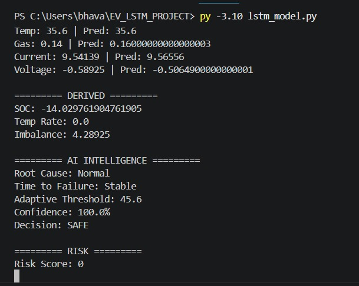
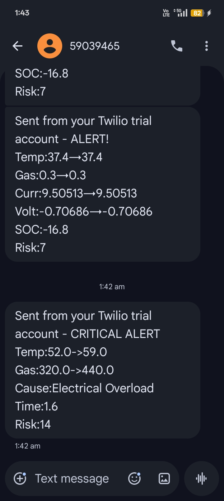
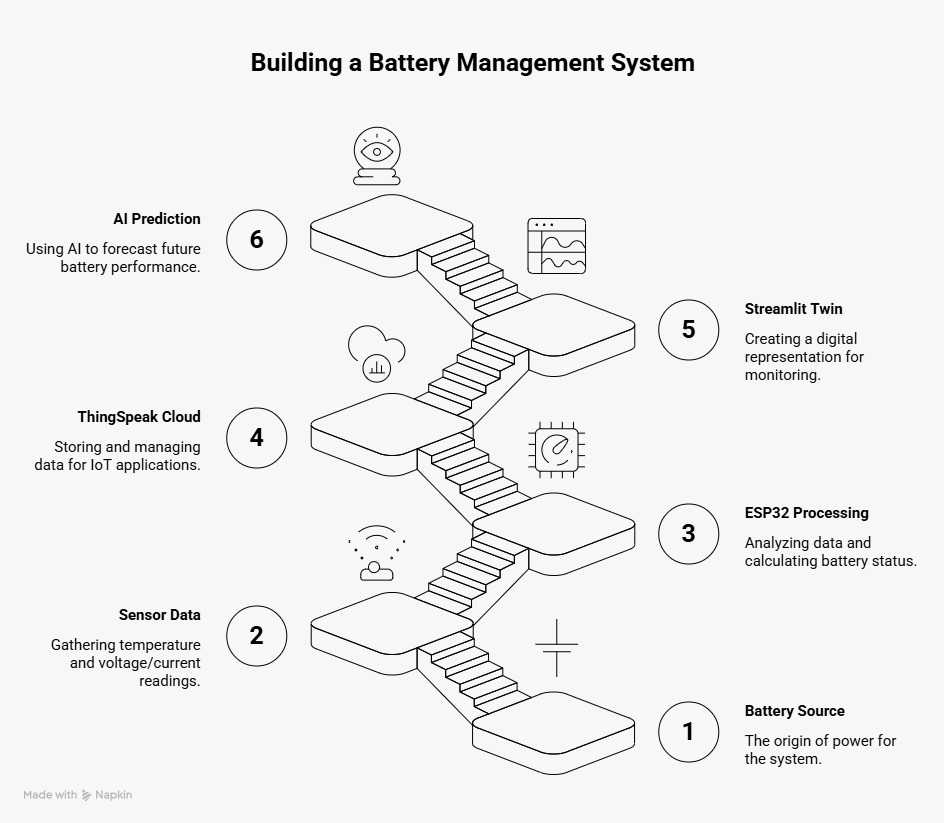
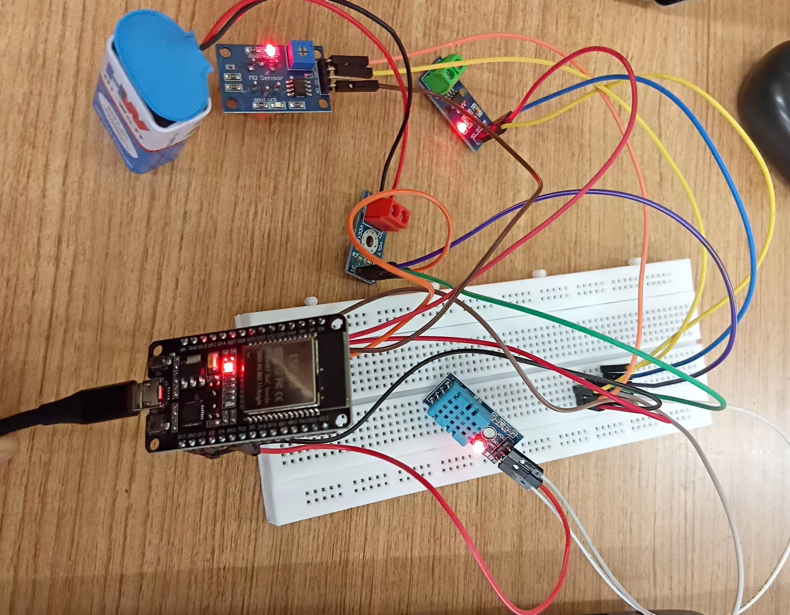

# AI-Based EV Battery Digital Twin for Fire Prevention - Nirmith

This project develops an intelligent digital twin model of an electric vehicle (EV) battery to predict and prevent fire hazards. The system continuously monitors key battery parameters such as temperature, current, voltage, rate of temperature change (dT/dt), state of charge (SOC), and cell imbalance using sensors and real-time data acquisition.

---

## 📊 Prediction Output

This image shows the AI model prediction results, classifying the battery condition into safe, risk, or unsafe states based on real-time parameters.

  

---

## 📩 SMS Alert System

This image represents the alert system that sends notifications to the user when abnormal battery conditions are detected, enabling quick preventive action.

  

---

## 🧩 System Architecture

This diagram illustrates the overall workflow of the system. It shows how real-time sensor data is collected from the battery, processed through the ESP32, transmitted to the cloud, and analyzed using AI models for early fire prediction.

  

---

## 🔌 Circuit Diagram

This diagram represents the hardware connections used in the project. It includes ESP32, temperature sensor (DHT11), voltage and current sensors, and gas sensor for detecting abnormal battery conditions.

  

---

## 🚀 Features

- Real-time monitoring of battery parameters  
- AI-based fire prediction system  
- Digital twin simulation  
- IoT integration using ThingSpeak  
- Early warning and alert system  

---

## ⚙️ Technologies Used

- ESP32 (Hardware)
- Python (AI Model)
- LSTM (Prediction)
- Streamlit (Dashboard)
- ThingSpeak (Cloud)

---

## 📊 Parameters Monitored

- Temperature  
- Current  
- Voltage  
- dT/dt (Rate of Temperature Change)  
- State of Charge (SOC)  
- Cell Imbalance  

---

## 🎯 Objective

To design a smart and intelligent system that predicts battery failures and prevents fire hazards in electric vehicles using real-time monitoring and AI techniques.
